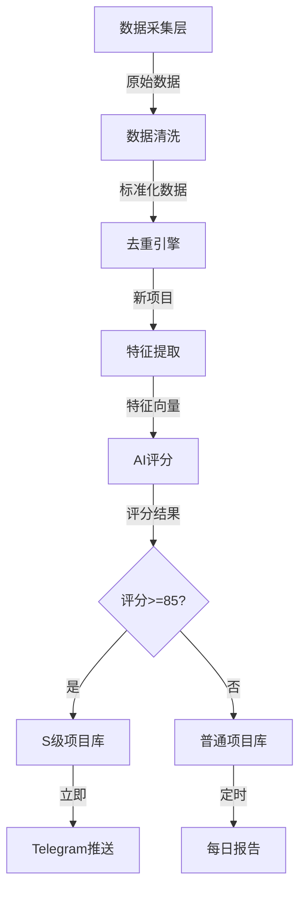
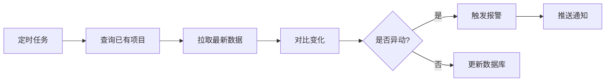

# 数据流设计文档

## 📊 数据流概览

```
数据采集 → 数据清洗 → 数据存储 → AI分析 → 报告生成 → 用户展示
   ↓          ↓          ↓         ↓         ↓          ↓
外部API    去重标准化   PostgreSQL  GPT-4    模板引擎   Web/Bot
```

---

## 🔄 核心数据流

### 流程1: 新项目发现流程



**流程说明**:
1. **采集阶段**: 每5分钟从10+数据源抓取数据
2. **清洗阶段**: 去除无效信息、标准化字段
3. **去重阶段**: 基于项目名/合约地址去重
4. **分析阶段**: AI提取特征并评分
5. **分流阶段**: S级项目立即推送，其他项目进入日报

**时效要求**:
- 从发现到推送: <30分钟 (S级项目)
- 从发现到日报: <24小时 (A/B级项目)

---

### 流程2: 数据更新流程



**更新频率**:
- 社交媒体数据: 每小时
- 链上数据: 每10分钟
- 价格数据: 每5分钟

**异动定义**:
- 价格变化 >20%
- 社区成员增长 >50%/天
- TVL变化 >30%
- 巨鲸地址买入 >$100k

---

## 🗂️ 数据模型设计

### 核心表结构

#### 1. projects (项目主表)

```sql
CREATE TABLE projects (
    id SERIAL PRIMARY KEY,
    project_name VARCHAR(255) NOT NULL,
    symbol VARCHAR(50),
    contract_address VARCHAR(255) UNIQUE,
    blockchain VARCHAR(50),
    category VARCHAR(100), -- DeFi, NFT, GameFi, Infrastructure
    
    -- 基础信息
    description TEXT,
    website VARCHAR(500),
    whitepaper_url VARCHAR(500),
    twitter_handle VARCHAR(100),
    telegram_channel VARCHAR(100),
    discord_link VARCHAR(500),
    github_repo VARCHAR(500),
    
    -- 评分相关
    overall_score DECIMAL(5,2), -- 综合评分 0-100
    team_score DECIMAL(5,2),
    tech_score DECIMAL(5,2),
    community_score DECIMAL(5,2),
    tokenomics_score DECIMAL(5,2),
    market_timing_score DECIMAL(5,2),
    risk_score DECIMAL(5,2),
    
    grade VARCHAR(1), -- S, A, B, C
    
    -- 状态
    status VARCHAR(50), -- discovered, analyzing, published, archived
    first_discovered_at TIMESTAMP,
    last_updated_at TIMESTAMP,
    
    -- 元数据
    discovered_from VARCHAR(100), -- twitter, telegram, youtube, etc.
    created_at TIMESTAMP DEFAULT CURRENT_TIMESTAMP,
    updated_at TIMESTAMP DEFAULT CURRENT_TIMESTAMP
);

CREATE INDEX idx_projects_score ON projects(overall_score DESC);
CREATE INDEX idx_projects_grade ON projects(grade);
CREATE INDEX idx_projects_discovered_at ON projects(first_discovered_at DESC);
```

#### 2. social_metrics (社交媒体指标)

```sql
CREATE TABLE social_metrics (
    id SERIAL PRIMARY KEY,
    project_id INTEGER REFERENCES projects(id),
    
    -- Twitter数据
    twitter_followers INTEGER,
    twitter_engagement_rate DECIMAL(5,2),
    
    -- Telegram数据
    telegram_members INTEGER,
    telegram_online_members INTEGER,
    telegram_message_frequency INTEGER, -- 消息/小时
    
    -- Discord数据
    discord_members INTEGER,
    discord_online_members INTEGER,
    
    -- YouTube数据
    youtube_mentions INTEGER, -- 被提及次数
    youtube_total_views INTEGER,
    
    -- GitHub数据
    github_stars INTEGER,
    github_forks INTEGER,
    github_commits_last_week INTEGER,
    github_contributors INTEGER,
    
    -- 时间戳
    snapshot_time TIMESTAMP DEFAULT CURRENT_TIMESTAMP,
    
    UNIQUE(project_id, snapshot_time)
);

CREATE INDEX idx_social_metrics_project ON social_metrics(project_id);
CREATE INDEX idx_social_metrics_time ON social_metrics(snapshot_time DESC);
```

#### 3. onchain_metrics (链上数据)

```sql
CREATE TABLE onchain_metrics (
    id SERIAL PRIMARY KEY,
    project_id INTEGER REFERENCES projects(id),
    
    -- 基础数据
    market_cap DECIMAL(20,2),
    total_supply DECIMAL(30,2),
    circulating_supply DECIMAL(30,2),
    price_usd DECIMAL(20,8),
    
    -- 流动性数据
    liquidity_usd DECIMAL(20,2),
    volume_24h DECIMAL(20,2),
    
    -- 持有者数据
    holder_count INTEGER,
    top_10_holders_percentage DECIMAL(5,2),
    
    -- 交易数据
    transaction_count_24h INTEGER,
    unique_wallets_24h INTEGER,
    
    -- TVL (for DeFi)
    tvl_usd DECIMAL(20,2),
    
    -- 时间戳
    snapshot_time TIMESTAMP DEFAULT CURRENT_TIMESTAMP,
    
    UNIQUE(project_id, snapshot_time)
);

CREATE INDEX idx_onchain_metrics_project ON onchain_metrics(project_id);
CREATE INDEX idx_onchain_metrics_time ON onchain_metrics(snapshot_time DESC);
```

#### 4. ai_analysis (AI分析结果)

```sql
CREATE TABLE ai_analysis (
    id SERIAL PRIMARY KEY,
    project_id INTEGER REFERENCES projects(id),
    
    -- 文本分析
    whitepaper_summary TEXT,
    key_features JSONB, -- ["特性1", "特性2", ...]
    similar_projects JSONB, -- [{"name": "Solana", "similarity": 0.85}, ...]
    
    -- 情感分析
    sentiment_score DECIMAL(5,2), -- -1 到 1
    sentiment_label VARCHAR(20), -- positive, neutral, negative
    
    -- 风险识别
    risk_flags JSONB, -- [{"type": "team_anonymous", "severity": "medium"}, ...]
    scam_probability DECIMAL(5,2), -- 0-100
    
    -- 推荐建议
    investment_suggestion TEXT,
    position_size VARCHAR(50), -- 1-3%, 3-5%, 5-10%
    entry_timing VARCHAR(100),
    stop_loss_percentage DECIMAL(5,2),
    
    -- 时间戳
    analyzed_at TIMESTAMP DEFAULT CURRENT_TIMESTAMP
);

CREATE INDEX idx_ai_analysis_project ON ai_analysis(project_id);
```

#### 5. daily_reports (每日报告)

```sql
CREATE TABLE daily_reports (
    id SERIAL PRIMARY KEY,
    report_date DATE UNIQUE NOT NULL,
    
    -- 统计数据
    total_projects_scanned INTEGER,
    new_projects_found INTEGER,
    s_grade_count INTEGER,
    a_grade_count INTEGER,
    
    -- 报告内容
    report_content TEXT, -- Markdown格式
    
    -- 推送状态
    email_sent BOOLEAN DEFAULT FALSE,
    telegram_sent BOOLEAN DEFAULT FALSE,
    
    -- 时间戳
    generated_at TIMESTAMP DEFAULT CURRENT_TIMESTAMP,
    published_at TIMESTAMP
);
```

#### 6. user_watchlist (用户关注列表)

```sql
CREATE TABLE user_watchlist (
    id SERIAL PRIMARY KEY,
    user_id INTEGER REFERENCES users(id),
    project_id INTEGER REFERENCES projects(id),
    
    -- 提醒设置
    alert_price_change BOOLEAN DEFAULT TRUE,
    alert_community_growth BOOLEAN DEFAULT TRUE,
    alert_major_events BOOLEAN DEFAULT TRUE,
    
    -- 时间戳
    added_at TIMESTAMP DEFAULT CURRENT_TIMESTAMP,
    
    UNIQUE(user_id, project_id)
);
```

#### 7. alerts (报警记录)

```sql
CREATE TABLE alerts (
    id SERIAL PRIMARY KEY,
    project_id INTEGER REFERENCES projects(id),
    
    alert_type VARCHAR(50), -- price_spike, whale_activity, community_surge
    severity VARCHAR(20), -- low, medium, high, critical
    
    message TEXT,
    metadata JSONB, -- 额外信息
    
    -- 推送状态
    sent_to_users JSONB, -- [user_id1, user_id2, ...]
    
    triggered_at TIMESTAMP DEFAULT CURRENT_TIMESTAMP
);
```

---

## 🔄 数据同步策略

### 实时同步 (WebSocket)
- 链上交易数据
- 价格变动
- 新项目发现

### 高频同步 (5-10分钟)
- X/Twitter最新推文
- Telegram频道消息
- DEX新增交易对

### 中频同步 (1小时)
- YouTube新视频
- 社交媒体粉丝数
- GitHub代码提交

### 低频同步 (24小时)
- 项目白皮书更新
- 团队信息变更
- 深度报告生成

---

## 📦 数据存储方案

### PostgreSQL (主数据库)
- 结构化数据: 项目信息、评分、指标
- 事务支持: 确保数据一致性
- 时序扩展: TimescaleDB 优化时间序列数据

### Redis (缓存层)
- 热点数据缓存 (项目列表、排行榜)
- 任务队列 (Celery)
- 去重集合 (已处理的推文ID)

### S3/OSS (对象存储)
- 白皮书PDF文件
- 项目Logo图片
- 每日报告归档

### Elasticsearch (可选)
- 全文搜索: 项目名称、描述
- 日志分析: 系统运行日志

---

## 🔐 数据安全

### 敏感数据处理
- API密钥: 环境变量 + 密钥管理服务
- 用户密码: bcrypt加密
- 付费信息: 符合PCI DSS标准

### 数据备份
- 自动备份: 每日全量备份
- 增量备份: 每6小时
- 异地容灾: 至少2个地域

### 访问控制
- 数据库白名单
- API限流
- 用户权限分级

---

## 📊 数据质量保障

### 数据验证规则

```python
# 项目数据验证
def validate_project_data(data):
    checks = {
        "project_name": lambda x: len(x) > 0 and len(x) < 255,
        "contract_address": lambda x: is_valid_address(x),
        "twitter_handle": lambda x: x.startswith('@'),
        "overall_score": lambda x: 0 <= x <= 100,
    }
    
    for field, validator in checks.items():
        if field in data and not validator(data[field]):
            raise ValidationError(f"Invalid {field}")
```

### 异常数据监控
- 评分突然变化 >30分 → 触发人工审核
- 社区数据异常增长 (疑似刷量) → 标记
- 价格数据缺失 → 使用备用数据源

---

## 🔄 数据迁移计划

### Phase 1 → Phase 2 迁移
- 新增字段: `ai_confidence_score`
- 数据回填: 对历史项目重新评分
- 索引优化: 添加复合索引

### 数据归档策略
- 6个月前的项目 → 归档表 (projects_archive)
- 保留评分 >80 的历史项目
- 删除已确认骗局项目数据

---

**文档版本**: v1.0  
**最后更新**: 2025-10-02

